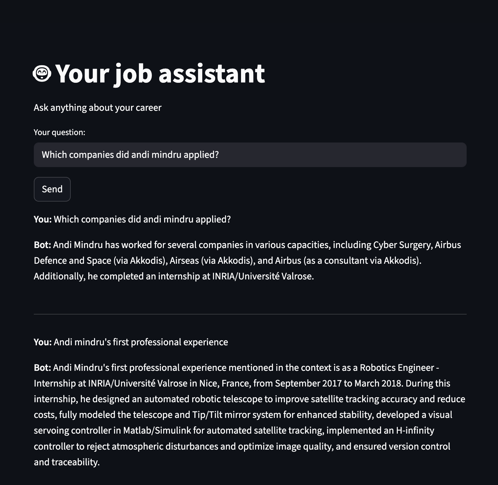

# RAGchatbot

A RAG (Retrieval-augmented generation) chatbot that can be trained on your custom documents (PDFs). It can then answers according to your custom data.

- The chatbot is made using a LLM model infered from Hugging Face and the framework LlamaIndex
- The backend is done using FastAPI
- The UI is created with Streamlit

## Installation

- Download locally the folder
- Add a new data/ folder with the pdf documents you want the chatbot to be trained on
- Add a .env document where you put your API keys: for Hugging Face as HF_TOKEN="...", llama cloud LLAMA_CLOUD_API_KEY=".."
- You can launch the application by running the app.sh script: this will create a virtual environnement, will install the dependencies in requirements.txt, will launch the backend server as well as the frontend UI. Please change the virtul env activation in the bash script according to your OS (default is MAC)

